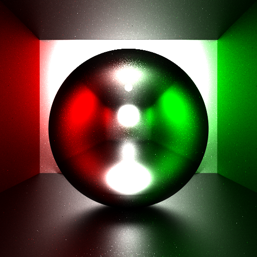
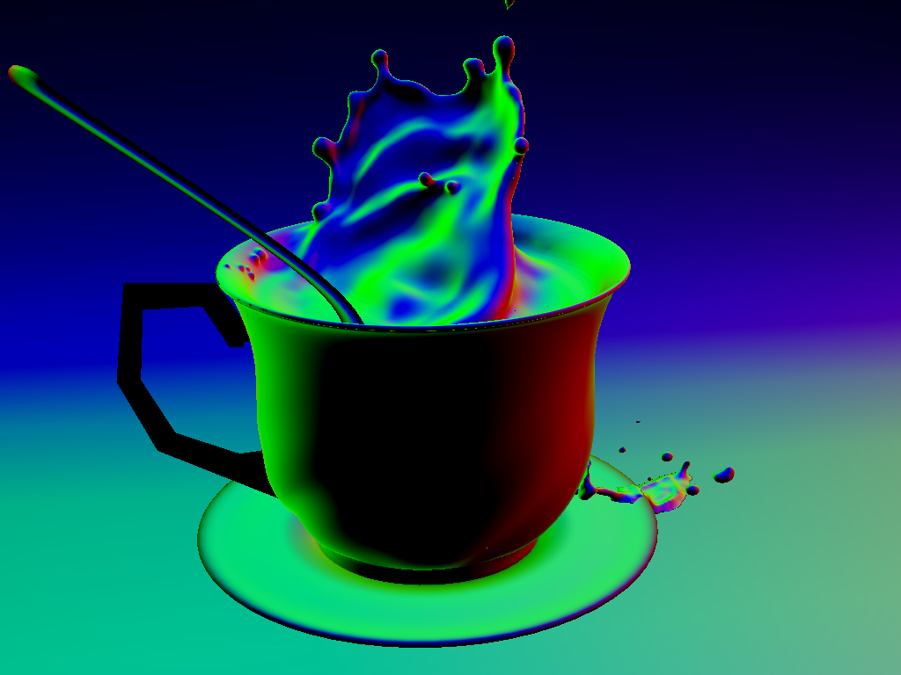

# cuda-raytracer

## Current Status

* Basic cuda raytracing framework was successfully **built, tested and profiled**.
	* Nvidia Tesla K40m
* Compatible CPU multicore version was **built and tested**.
	* Intel(R) Core(TM) i7-8550U CPU @ 1.80GHz, 8 Logic Cores
	* Intel(R) Xeon(R) CPU E5-2670 v3 @ 2.30GHz, 48 Logic Cores
* Visualization module is currently broken because I modified the data structure of mesh. It is to be repaired soon.
* Material and BSDF system are being built, currently the raytracing kernel **does not integrate radiance**.
* Build environments:
	* Windows 10 Education Insider Preview 18290.rs_prerelease
		* MinGW-w64 8.1.0 (test CPU multicore)
	* CentOS Linux release 7.5.1804 (Core)
		* CUDA 9.0 (test cuda)
		* gcc (GCC) 6.3.1 20170216 (Red Hat 6.3.1-3)

## Progressive Works

- [X] Polymorphism
> - [X] Spheres
> - [ ] Other
- [X] Bidirectional Path Tracer
> - [X] Point Lights
> - [ ] Spot Lights
> - [X] Area Lights
> - [ ] Heuristic Light Estimation 
- [ ] Acceleration
> - [ ] Hybrid Renderer
> - [ ] Reduce GPU Divergency
- [ ] Refactor
> - [ ] Several Classes 
> - [ ] DSL
- [ ] Material
> - [X] Mat Sphere
> - [ ] Mixed Shader(Blender)
> - [ ] BTDF
- [ ] Microfacet Distribution
> - [X] Cosine
> - [X] Beckmann
> - [ ] GGX
> - [ ] Other

## Gallery

*Bidirectional Path Tracing, intel core i7x8 logical cores, 1024spp*

```json
{
	"assets": [
		["pointLight", {
			"position": [2, 0, 3],
			"emissive": [1, 1, 1]
		}],
		["sphere", {
			"o": [0, 0, 1],
			"r": 1,
			"material": "Material"
		}],
		["sphere", {
			"o": [-1e3, 0, 0],
			"r": 997,
			"material": "Wall"
		}],
		["sphere", {
			"o": [1e3, 0, 0],
			"r": 995.9,
			"material": "Wall"
		}],
		["sphere", {
			"o": [0, -1e3, 0],
			"r": 998,
			"material": "LeftWall"
		}],
		["sphere", {
			"o": [0, 1e3, 0],
			"r": 998,
			"material": "RightWall"
		}],
		["sphere", {
			"o": [0, 0, -1e3],
			"r": 1e3,
			"material": "Wall"
		}],
		["sphere", {
			"o": [0, 0, 1e3],
			"r": 997,
			"material": "Wall"
		}]
	],
	"camera": [{
		"position": [4, 0, 1],
		"fovx": 45
	}],
	"material": {
		"Wall": ["Microfacet", {
			"distribution": ["Beckmann", {
				"roughness": 0.2
			}],
			"color": [1, 1, 1]
		}],
		"LeftWall": ["Microfacet", {
			"distribution": ["Beckmann", {
				"roughness": 0.45
			}],
			"color": [1, 0, 0]
		}],
		"RightWall": ["Microfacet", {
			"distribution": ["Beckmann", {
				"roughness": 0.45
			}],
			"color": [0, 1, 0]
		}],
		"Material": ["Microfacet", {
			"distribution": ["Beckmann", {
				"roughness": 0.02
			}],
			"color": [1, 1, 1]
		}]
	}
}
```



*Microfacet BRDF with Beckmann Distribution of different roughness*

```json
{
	"assets": [
		["import", {
			"path": "./x6.blend"
		}]
	],
	"camera": [],
	"material": {
		"Material": ["Microfacet", {
			"distribution": ["Beckmann", {
				"alpha": 0.5
			}],
			"color": [0.608, 0.522, 0.333]
		}],
		"luz": ["Luz", {
			"emissive": [50, 50, 50]
		}],
		"cafe": ["Microfacet", {
			"distribution": ["Beckmann", {
				"alpha": 0.1
			}],
			"color": [0.275, 0.25, 0.23]
		}],
		"Material.001": ["Microfacet", {
			"distribution": ["Beckmann", {
				"alpha": 0.6
			}]
		}],
		"porcelana": ["Microfacet", {
			"distribution": ["Beckmann", {
				"alpha": 0.3
			}],
			"color": [0.545, 0.463, 0.427]
		}],
		"DefaultMaterial": ["Lambert"]
	}
}
```


*Perfect mirror reflection.*



## Previous Works

*The ray emitter of this version is somehow buggy, and raytracing process is not completely correct.*

### CPU Single Core Brute-Force 1024spp


## Requirements

* gcc 4.8+
* assimp
* cuda [ optional ]
* gl & glfw3 [ optional ]

## Design Rules

The tracer aimed at working on heterogeneous systems.

### Optional

* Use `-DCUDA=ON` to enable cuda toolkits. If so, macro `KOISHI_USE_CUDA` will be defined.

* Use `-DGL=ON` to enable bvh visualization. If so, macro `KOISHI_USE_GL` will be defined, all `vis/*` source code will we included. 

### Visualization

Use `vis::Renderer`.

```cpp
#include <vis/renderer.hpp>

using namespace koishi;

int main( int argc, char **argv )
{
	vis::Renderer r{ 1024, 768 };

	r.render( "./cow.json" );
}

```

### Tracing

Tracing functions are defined using `PolyFunction` macro:

```cpp
// template <typename T>  // optional
PolyFunction( name, requirements ) (
	( parameters ) -> value_type {
		// do sth
	}
);
```

* `name` is the name of that poly-function.
* `requirements` is one or more class defination which the function requires to work, using template Require<>.
* the function body lies in the second bracket.

e.g.

```cpp
PolyFunction( DRand48, Require<Host> )(
  ()->double {
	  static unsigned long long seed = ( ( (long long int)time( nullptr ) ) << 16 ) | ::rand();

	  constexpr auto m = 0x100000000LL;
	  constexpr auto c = 0xB16;
	  constexpr auto a = 0x5DEECE66DLL;
	  seed = ( a * seed + c ) & 0xFFFFFFFFFFFFLL;
	  unsigned int x = seed >> 16;
	  return ( (double)x / (double)m );
  } );
```

poly-function DRand48 works **only on host machine** (`Require<Host>`).

```cpp
PolyFunction( F, Require<Host>, Require<Device> )(
  (...)->double3 {
	  // poly-function F works on both host(cpu) and device(gpu).
  } );
PolyFunction( G, Require<F> )(
  ()->double3 {
	  // poly-function G works on all platforms that F supports.
  } );
PolyFunction( H, Require<F, G> )(
  ()->double3 {
	  // poly-function H works on all platforms that F, G both supports.
	  // use `call<>()` function in poly-function to call other poly-functions
	  auto res = call<F>(...);	 // if the function H is executed on host, that's a host call, otherwise a device call.
  } );
PolyFunction( J, Require<F, G, Device> )(
  ()->double3 {
	  // poly-function J works only on device(gpu) and F, G must both support gpu, or it leads to a compile error.
  } );
```

* PolyFunction is incompatible with `openmp`, but you u can use `std::thread` instead of it.
* use regular `__global__` call to emit jobs to gpu.

## Usage

### Build

```bash
cmake . -Bbuild -DGL=ON/OFF -DCUDA=ON/OFF
cmake --build build --target cr
```

### Render

```bash
./cr ./spaceship.json -o a.png --resolution=1024x512 -k Radiance -s 64
```
