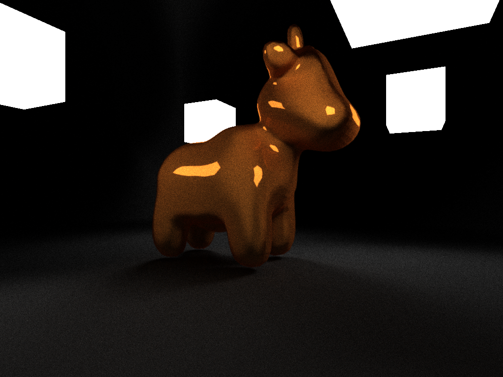
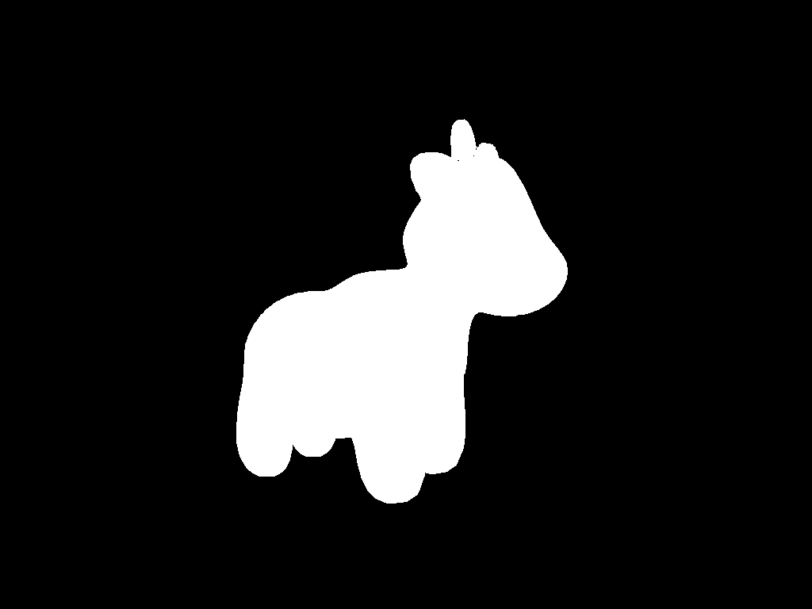

# cuda-raytracer

## Examples

### CPU Single Core 1024spp



### CPU Single Core 128spp


## Requirements

* gcc 4.8+
* assimp
* cuda [ optional ]
* gl & glfw3 [ optional ]

## Design Rules

The tracer aimed at working on heterogeneous systems.

### Optional

* Use `-DCUDA=ON` to enable cuda toolkits. If so, macro `KOISHI_USE_CUDA` will be defined.

* Use `-DGL=ON` to enable bvh visualization. If so, macro `KOISHI_USE_GL` will be defined, all `vis/*` source code will we included. 

### Visualization

Use `vis::Renderer`.

```cpp
#include <vis/renderer.hpp>

using namespace koishi;

int main( int argc, char **argv )
{
	vis::Renderer r{ 1024, 768 };

	r.render( "./cow.json" );
}

```

### Tracing

Tracing functions are defined using `PolyFunction` macro:

```cpp
// template <typename T>  // optional
PolyFunction( name, requirements ) (
	( parameters ) -> value_type {
		// do sth
	}
);
```

* `name` is the name of that poly-function.
* `requirements` is one or more class defination which the function requires to work, using template Require<>.
* the function body lies in the second bracket.

e.g.

```cpp
PolyFunction( DRand48, Require<Host> )(
  ()->double {
	  static unsigned long long seed = ( ( (long long int)time( nullptr ) ) << 16 ) | ::rand();

	  constexpr auto m = 0x100000000LL;
	  constexpr auto c = 0xB16;
	  constexpr auto a = 0x5DEECE66DLL;
	  seed = ( a * seed + c ) & 0xFFFFFFFFFFFFLL;
	  unsigned int x = seed >> 16;
	  return ( (double)x / (double)m );
  } );
```

poly-function DRand48 works **only on host machine** (`Require<Host>`).

```cpp
PolyFunction( F, Require<Host>, Require<Device> )(
  (...)->double3 {
	  // poly-function F works on both host(cpu) and device(gpu).
  } );
PolyFunction( G, Require<F> )(
  ()->double3 {
	  // poly-function G works on all platforms that F supports.
  } );
PolyFunction( H, Require<F, G> )(
  ()->double3 {
	  // poly-function H works on all platforms that F, G both supports.
	  // use `call<>()` function in poly-function to call other poly-functions
	  auto res = call<F>(...);	 // if the function H is executed on host, that's a host call, otherwise a device call.
  } );
PolyFunction( J, Require<F, G, Device> )(
  ()->double3 {
	  // poly-function J works only on device(gpu) and F, G must both support gpu, or it leads to a compile error.
  } );
```

* PolyFunction is incompatible with `openmp`, but you u can use `std::thread` instead of it.
* use regular `__global__` call to emit jobs to gpu.

## Usage

### Build

```bash
cmake . -Bbuild -DGL=ON/OFF -DCUDA=ON/OFF
cmake --build build --target cr
```

### Render

```bash
./cr ./cow.json a.png 4
# cr <scene.json> <out.png> <spp>
```

## Gallery

### BVH visualization


### BBox

CPU intersect bbox:


CPU intersect triangle:



### Lambert

